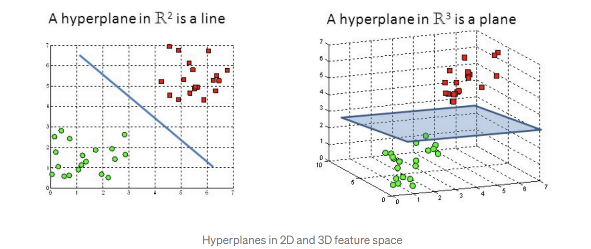
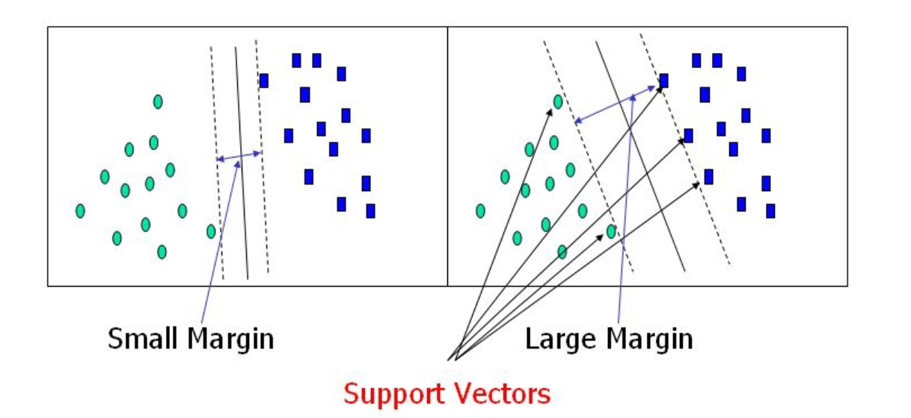

## Support Vector Machine(SVM)

* Support vector machine is highly preferred by many as it produces significant accuracy with less computation power. 
* Support Vector Machine, abbreviated as SVM can be used for both regression and classification tasks. But, it is widely used in classification objectives.
* The objective of the support vector machine algorithm is to find a hyperplane in an N-dimensional space(N — the number of features) that distinctly classifies the data points.

* When talking in terms of linearly separable points,

* When we create this dotted hyperplane, which is parallel to the main hyperplane, we make sure both the dotted planes passed to at least nearest one point on both sides.
* Distance between two dotted lines is called as marginal distance.
* If in test data some point comes between main hyperplane and dotted hyperplane, then it will be classified to class wrt dotted plane(i.e. which dotted plane, if nearer to blue points one then it will be classified as blue point else red point)

* To separate the two classes of data points, there are many possible hyperplanes that could be chosen. Our objective is to find a plane that has the maximum margin, i.e the maximum distance between data points of both classes. Maximizing the margin distance provides some reinforcement so that future data points can be classified with more confidence. Higher the marginal distance, more genralized our model is(in case of linearly separable dataset).

* Hyperplanes are decision boundaries that help classify the data points. Data points falling on either side of the hyperplane can be attributed to different classes. Also, the dimension of the hyperplane depends upon the number of features. If the number of input features is 2, then the hyperplane is just a line. If the number of input features is 3, then the hyperplane becomes a 2D plane. It becomes difficult to imagine when the number of features exceeds 3.

* Support vectors are data points that are closer to the hyperplane and influence the position and orientation of the hyperplane. Using these support vectors, we maximize the margin of the classifier. Deleting the support vectors will change the position of the hyperplane. These are the points that help us build our SVM.

* SVMs are great when dataset is small.

## Classify non linearly separable data points:
* For this we use SVM Kernels, where we convert low dimenstion to high dimension(like 2D graph to 3D graph)

## Advantages of SVM:
* It is more effective in high dimensional spaces.
* It is relatively memory efficient.
* SVM’s are very good when we have no idea on the data.
* It works well with even unstructured and semi structured data like text, Images and trees.
* The kernel trick is real strength of SVM. With an appropriate kernel function, we can solve any complex problem.
* SVM models have generalization in practice, the risk of over-fitting is less in SVM.

## Disadvantages of SVM:
* More training time is required for larger dataset
* It is difficult to choose a good kernel function.
* The SVM hyper parameters are Cost -C and gamma. It is not that easy to fine-tune these hyper-parameters. It is hard to visualize their impact.

## Applications:
* We can use SVM with every ANN usecases.
* Intrusion Detection
* Handwriting Recognition

## Practical Implmentation:
* https://scikit-learn.org/stable/modules/generated/sklearn.svm.SVC.html
* https://scikit-learn.org/stable/modules/generated/sklearn.svm.SVR.html