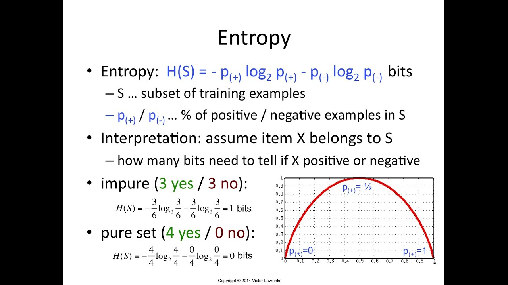
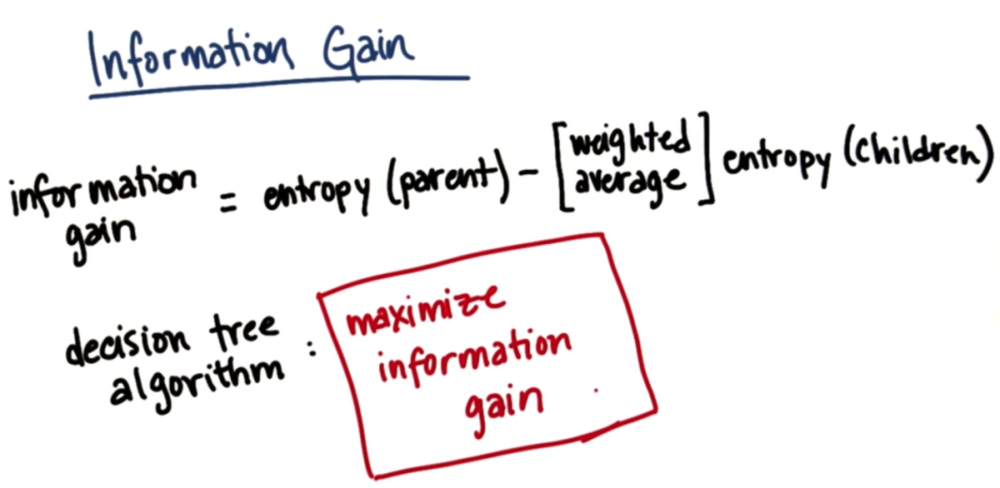
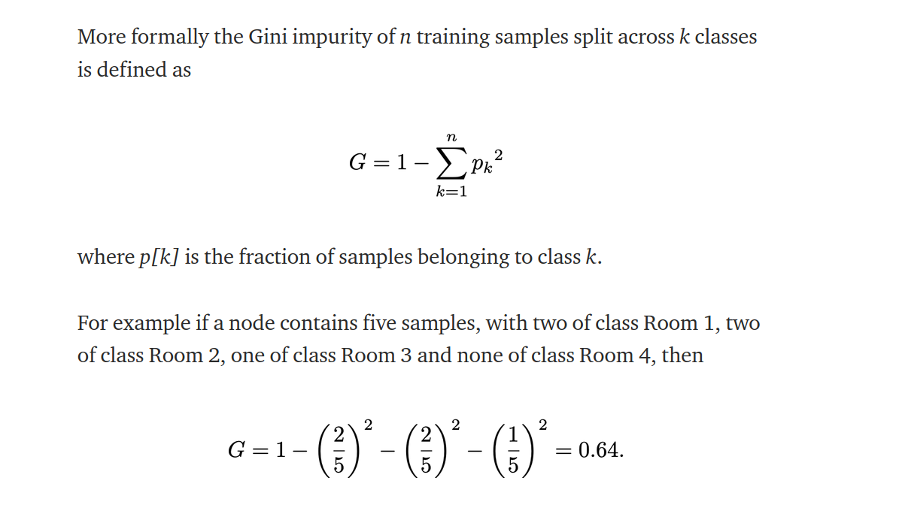

## Decision Trees
 
 Decision tree is the powerful and popular tool for classification and prediction. A Decision tree is a flowchart like tree structure, where each internal node denotes a feature(or test on an attribute), each branch represents an outcome of the test, and each leaf node (terminal node) holds a class label.
 In order to build a tree, we use an algorithm called CART(classification and regresion tree)

### Some basic terms:

 * Root Node: Base node of the tree, it represents the entire sample and this gets classified into two or more homogeneous sets.
 * Leaf Node: We get this when we reach at the end of the tree
 * Splitting: Dividing root node or sub-node to further sets based on some condition.
 * Branch/Sub Tree: It is formed, when tree or node is splitted. In other words, it is a sub section of entire tree.
 * Pruning: It is opposite of splitting. It is removing of unwanted branches from tree.
 * Impurity: For example if a bag has just blue color balls and we have to find probability that we pick blue color ball only, then in that case impurity is zero. But if that same bag has different color balls, then impurity will be greater than 0.
 
### Important terms:
* **Entropy**: It is the measure of impurity(or purity). It defines randomness in data. It is the first step to solve the problem of decision tree. In order to select best attribute of the node, which can be used for splitting further, we use entropy.
Entropy values ranges between 0 to 1(1 means completely impure subset, like when we have equal number of yes and no). We calculate entropy for available attributes and finally choose one lowest entropy. When we get 0 as entropy we call it as a pure sub split and then it is treated as leaf node. The entropy equation uses logarithms because of many advantageous properties. The Main advantage is the additive property it provides.
 It is given by:
 

	* Here 3 yes and 3 no is worst split and is impurest, where 4 yes and 0 no is best split and is purest.
	* For a single node, we can find which feature is to be selected among other features for splitting by considering featuring giving less entropy.
	* When we get pure split entropy(i.e. 0) we consider that as leaf node.
	* But this is just for a node, we have to check for whole sub-tree below too till leaf node and add their entropy values, to get best split possible. For this we use Information Gain.

* **Information Gain**: It measures the reduction in entropy, it decides which attribute should be selected as decision node. Constructing decision trees involves finding attribute that returns highest information gain. It is given by
 
 	* Information gain calculates total entropy value from that node to bottom.
 	* We calculate entropy for each cases and then calculate information gain also, and then compare the information gain.
 	* Formula for Information gain is:

 	

 	* E(S) is entropy of the selected node(feature), S is the total subset, Si is node subset after splitting, E(Si) is entropy of the subset after splitting
 	* E(S) uses the same formula of entropy. We use summation as we have to consider all the feature of the subset.

* **Gini Impurity(or Gini Index)**: It is measure of impurity(or purity) used in build decision tree in CART.
	* Sometimes in algorithms, like random forest, XGBoost, gini impurity is used as parameter instead of entropy, because it is computationally efficient(takes short time for execution) as we can see we don't do any logarithm operation in gini impurity. 
	

	* A Gini score gives an idea of how good a split is by how mixed the classes are in the two groups created by the split. A perfect separation results in a Gini score of 0, whereas the worst case split that results in 50/50 classes in each group result in a Gini score of 0.5 (for a 2 class problem).
	* After this gini impurity or entropy we eventually calculate Information gain.

* **Reduction in variance**: It is an algo which is used for continuous target variable(regression problems). The split with lower variance is selected as the criteria to split the sample.

* **Chi Sqaure**: It is an algo to find out the statistical significance between the differences between sub nodes and parent node.

### Notes:
* When we want to split, then at each node we want best split value and best split threshold so to find which one is best feature to split.
* Our aim to get leaf node, when there is a pure split we get leaf node.
* Algorithm:
	- Start from the top node and at each node select best split on the basis of information gain.
	- Infomation gain can be calculated using immediate child entropies and parent entropy.
	- Greedy search is used: so loop over all features and all thresholds(all possible feature values)
	- Save the best split and split threshold at each node.
	- Build the like this recursively while considering some stop condition.
	- When leaf node is reached, store the most common label of the node.
	- Till above it will be done in training phase, now for predicting, again traverse the tree recursively
	- At each node consider best split feature of the test feature vector x and traverse left or right; like x[feature_idx] <= threshold
	- When leaf label is reached then return the most common class label.

* Outliers does not impact Decision tree as they does not use any distance metrics to calculate .They uses probilities by entropy, information gain or gini index to create the tree.
* One important property of decision tree is: Decision trees usually have low bias and high variance(overfitting case). We can convert high variance to low variance using simple techniques of hyperparameter tuning like decision tree pruning.
* In decision tree regressor, entroy and info gain is not used, we use MSE here.

### Split for Numerical feature
[Watch this!](https://www.youtube.com/watch?v=5O8HvA9pMew)