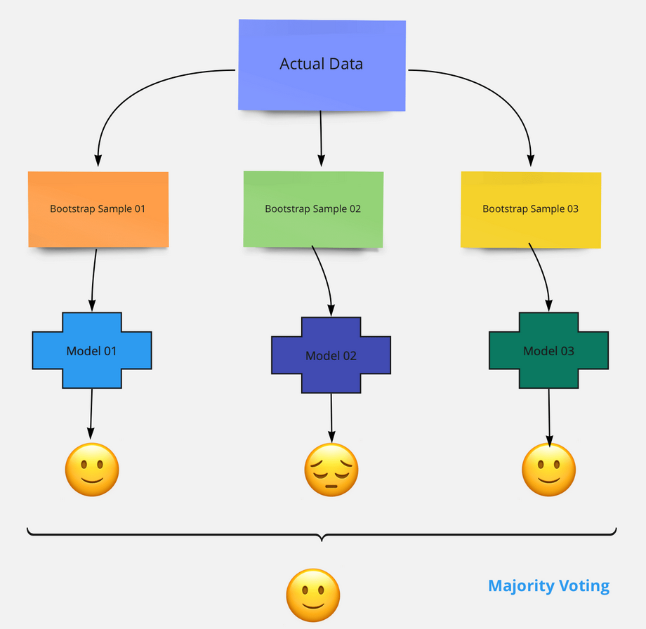
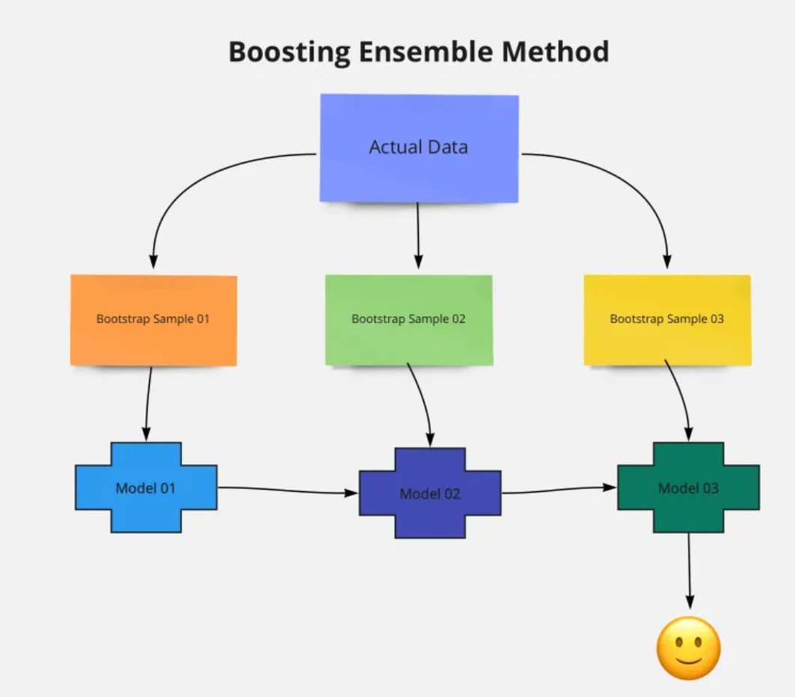

## Ensemble Learning:

* Ensemble means: a group of items viewed as a whole rather than individually or a group of musicians, actors, or dancers who perform together.
* Ensemble learning: In statistics and machine learning, ensemble methods use multiple learning algorithms to obtain better predictive performance than could be obtained from any of the constituent learning algorithms alone.
* Ensemble learning is the process by which multiple models, such as classifiers or experts, are strategically generated and combined to solve a particular computational intelligence problem.
* Ensemble learning is primarily used to improve the (classification, prediction, function approximation, etc.) performance of a model, or reduce the likelihood of an unfortunate selection of a poor one.

* In ensemble learning we basically have two techniques:
	* Bagging(also called as Bootstrap Aggregation)
		* One of the algorithm here is Random Forest(here we use multiple decision trees)
	* Boosting
		* Some of the algorithms in boosting are: AdaBoost, Gradient boosting, XGBoost(Extreme Gradient Boosting)

### Bagging:

* In the bagging method, all the individual models are built parallel, each individual model is different from one other. In this method, all the observations in the bootstrapping sample will be treated equally. In other words, all the observations will have equal at zero weightage. Because of this bagging method also called bootstrap aggregating.
* As a first step using the bootstrapping method, we will split the dataset into N number of samples. Then we will select the algorithm we want to try.
* Suppose if we selected a decision tree, then each bootstrap sample will be used for building one random forest model. Don’t forget all the decision trees are built in parallel.

* To each model we will give sample data to train it. Let's say if there are three models then we will divide our dataset(D) to D1, D2, D3 and these dataset will be given to model M1, M2 and M3 respectively. Here to divide dataset we are using row sampling with replacement.

* Once the training phase is completed, to predict the target outcome, we will pass the testing data to all the N decision trees. If we just talk for in terms of single test element, each decision tree will predict one target outcome for it. The final prediction target will be selected based on the majority voting.
* Suppose we build 10 decision tree models. The target is a binary target. Let’s say the target class could be 1 or 0. Then each decision tree will predict 1 or 0. Out of 10 decision trees, 8 trees are predicted as 1, and 2 trees predicted as 0 by majority voting means the final predicted class will be 1.
* The bagging methods can be used for both classification and regression problems. If we are using the bagging method of classification method, we use the majority voting approach for the final prediction. Whereas for the regression kind of problems, we take the average of all the values predicted by individual models.
* Pros: Bagging helps in reducing the overfitting. As we are averaging all the models outputs using the majority voting approach.
* Cons: For regression models the predicted value won’t be optimised. if any one of the models is deviating more as the output value will be average of all the models.

### Boosting:

* In the boosting method, all the individual models are built sequentially. Which means the outcome of the first model passes to the next model and etc. Models here are called as base learning model.

* In bagging the models are built parallel so we don’t know what the error of each model is. Whereas in boosting once the first model built we know the error of that model. So when we pass this first model to the next model the intention is to reduce the error further. In some boosting algorithm, each model has to reduce a minimum of 50% of error.
* For example if there are n records and they are passed to first model, then let' say 3 records were incorrectly classified, then next model will take these three records and will try to reduce error. Then let's say this second model also classifies some wrong records then third model will come into play and will try to reduce error if second model. Now this goes on till the specified number of models.

* Unlike bagging all the observations in the bootstrapping sample are not equally treated in boosting. Observations will have some weightage. For a few observations, the weightage will be high for others lower.
* Suppose we are building a binary classification model. The first model is not accurately predicting the class 01 target, then the input to the second model will get in sequentially way, saying focus more on predicting target class 01. 
* When selecting the data samples from the bootstrap sample few observations will have high weightage, in this case the data point which can help in accurately predicting the target class 01 will have higher weightage than the other data points.
* For the final target, the predictions from all the models will be weighted. Hence the final prediction will be the weighted average.
* So we can say that: In boosting all the individual models will build one after the other. Each model output will pass as input to the next model along with next model bootstrap sample data. 

* Pros: 
	* Boosting reduces the bias, As each model tries to reduce the errors of the previous model in the sequential chain. 
	* We can use multiple loss functions to reduce the error in each sequential models.
* Cons:
	* Boosting method tends to over-fitting, As the models build sequentially, all the models try to reduce the train error.
	* We need special care in turning the hyper-parameters.

### Which one to choose- Bagging or Boosting?
* This totally depends on the problem.
* Let’s say if the individual models are getting low model performance then in the bagging the combination of all the low performance models will lead to the low performing model. Whereas if the individual models are ovefitting then the final model with the boosting method will lead to an overfitting model, in such case we can use the bagging method.