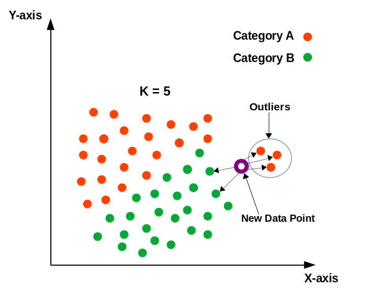

## KNN(k-nearest neighbors algorithm)

* The k-nearest neighbors (KNN) algorithm is a simple algorithm that stores all the available cases and classifies the new data or case based on similarity measure.
* 'K' denotes number of nearest neighbors which helps to predict class of new data or testing data.
* The KNN algorithm assumes that similar things exist in close proximity. In other words, similar things are near to each other.
* It is a simple, easy-to-implement supervised machine learning algorithm that can be used to solve both classification and regression problems.
* There is no need to train a model in KNN, that is why KNN is known as the simple and instance-based learning algorithm.
* Euclidean distance between two neighbors is calculated. Refer to [this](https://www.mathsisfun.com/algebra/distance-2-points.html). For distance between two points we can also use Manhattan distance instead of Euclidean distance. Usually in most the problems we use euclidean distance and in some of the cases we use Manhattan Distance.
* KNN are used in recommendation systems, like in Amazon it shows similar items when you have added a item on a cart.
* KNN algorithm is also a lazy learner because there is no learning phase of the model here, all of the work happens when prediction is requested.

### KNN Algorithm:
	* Load the data
	* Initialize K to your chosen number of neighbors
	* For each point in the test data do the following -
		1. Calculate the distance between test data and each row of training data with the help of any of the method namely: Euclidean, Manhattan or Hamming distance.
		2. Add the distance and the index of the example to an ordered collection
	* Sort the ordered collection of distances and indices from smallest to largest (in ascending order) by the distances
	* Pick the first K entries from the sorted collection
	* Get the labels of the selected K entries
	* If regression, return the mean of the K labels
	* If classification, return the mode of the K labels

- The algorithm gets significantly slower as the number of examples and/or predictors/independent variables increase.

### Important Notes:
* Let's say if we have a imbalanced dataset which has total 1000 rows, in which, 900 values are category-1 and and 100 are category-2. And if we have a new data point, so will it be biased towards category-1? Answer is yes because when we will find K nearest neighbors, most of the points will come from category-1.
* If data has outliers will it be impacted? Let' say these are our data points:

Here in this scenario, the outliers will impact the classification/prediction of the model. The appropriate class for the new data point, according to the following diagram, should be “Category B” in green. The model, however, would be unable to have the appropriate classification due to the existence of outliers. As a result, removing outliers before using KNN is recommended.
* In case of binary classification, try to keep K value odd, as if it is kept even then, there is a possibility that both categories can have equal neighbors. Then we can't decide which is the nearest category(as we select mode in classification).
* In regression, there are no categories (we can assume that we have just a single value plotted to graph) so for K=5, we try to find mean of 5 nearest data point values.
* There are multiple variants of KNN, in scikit learn some algorithm used to compute the nearest neighbors: ball_tree, kd_tree, brute.