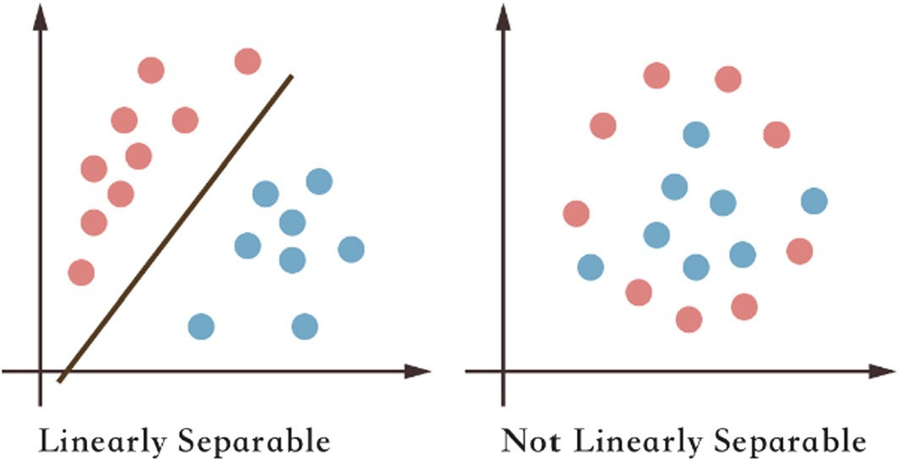
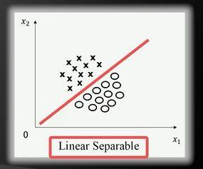
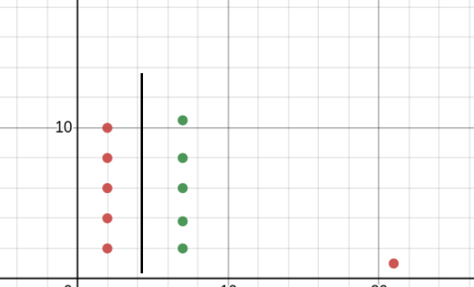
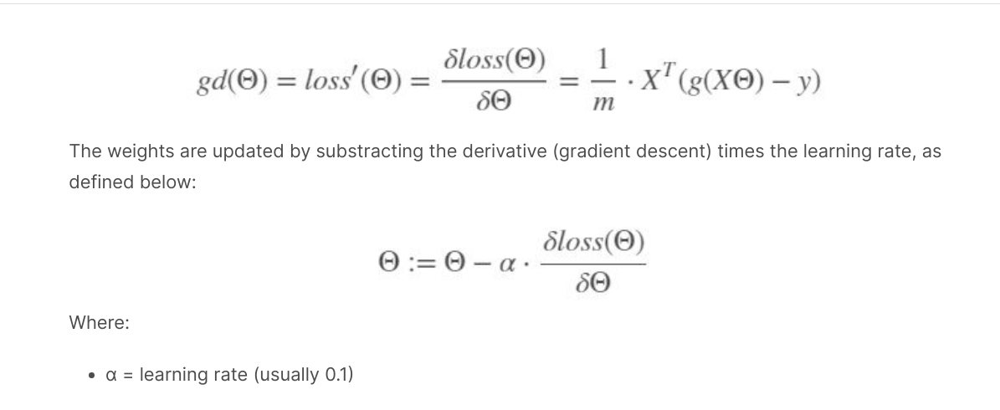
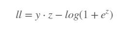
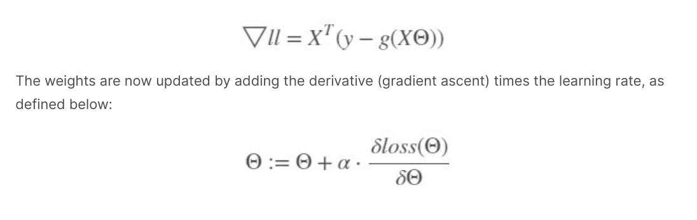

## Logistic Regression
It is a classification algorithm that is used to predict the probability of categorical dependent variable.

### Why Logistic Regression instead of Linear Regression for categorical case
* We can draw a best fit line here also but in the case when there are some outliers are present in the dataset then best fit line will be bit far away from the points and we can not predict correctly as there will be high error rate. This is the problem with linear regression because every time we have to create best fit line with respect to data points.
* Also we can get output greater than 1 and less than 0, but for binary classification we just have two classes. one class is between 0.5 and 1 and other one is between 0 and 0.5
* For example watch [this](https://www.youtube.com/watch?v=L_xBe7MbPwk&t=3m47s)

### Introduction
* Logistic regression is usually applied to problems where two set of data points can be linearly separable(can be divided with help of a straight line).

* Logistic regression is named for the function used at the core of the method, the logistic function.
* Logistic regression uses an equation as the representation, very much like linear regression. Input values (X) are combined linearly using weights or coefficient values to predict an output value (y). A key difference from linear regression is that the output value is a discrete rather than continuous.
* Logistic regression model consists of two components: sigmoid function and features with weights:

 - e = Euler's number which is 2.71828.

* The sigmoid function g(z) takes features and weights z as an input and returns a result between 0 and 1. The output of the sigmoid function is an actual prediction ŷ.
* Or we can say that, Sigmoid function is simply trying to convert independent variable into a expression of probability(which ranges b/w between 0 and 1) with respect to the dependent variable
* Where z = x1*w1 + ... + xn*wn
* If we plot the sigmoid function we can see curve like this:

* Read: https://jinglescode.github.io/2019/05/07/why-linear-regression-is-not-suitable-for-classification/
* It is named as ‘Logistic Regression’, because it’s underlying technique is quite the same as Linear Regression. The term “Logistic” is taken from the Logit function that is used in this method of classification. Logistic regression also does the same thing as Linear Regression but with one addition. It pass the result through a special function called logistic/sigmoid function to produce the output y.
* Watch [this](https://www.youtube.com/watch?v=uFfsSgQgerw) to know why we use sigmoid function.

### Working:
* Assume this is the data we have:

* Here we have to create a best fit line which can be used to linear separate the data. So equation of line: y =mx +x; where m is the slope, c is y-intercept, x is the data point and y is the output.
* Here the best fit line is not calculated with help of linear regression, there is some other way for that first we need to find exact coefficients `m` and `c`, from which we will be able to understand which is the best fit line.
* Now some assumptions for all the crosses in the image(all positive points) we will take +1 and for all circles(all negative points) are dentoted as -1.
* Also let's assume best fit line is passing through origin then we can say `c`(y-intercept) will be 0. So our updated equation is y = mx
* Now let's say if we have to find the distance between any one data point and the plane, by the help of linear algebra it can be given as: (mx+c) / || M || ; If we consider M as unit vector then it becomes 1 and also `c` is 0, as discussed in above point, so we get `mx`. Therefore we can say that distance between a data point to plane is `mx`.
* Now as there are many data points then we can do summation. Then eqn will be ∑(i=1 to n) mi.xi
* Also important point to note: If a data point is above the plane(As cross in above picture) then if we calculate the distance it will become +ve and if data point is below plane then distance is negative. 

* Let consider some cases,
	- Case 1: Let's consider any one cross point and we know that this xi is positive so here(as discussed in fourth point) we can denote it as y=+1 and distance for all cross points to the plane will be positive too(as discussed in last point). Therefore mx>0 and if we multiply y and mx we get value greater than zero: y * mx > 0. So we can say that whenever we get a positive value our xi (selected point) is correctly classified.

	- Case 2: Let's consider any one circle point and we know that this xi is negative so here we can denote it as y=-1 and distance for all cross points to the plane will be negative. Therefore mx < 0 and we multiply y and mx we get value greater than zero: -y * -mx > 0. So we can say that whenever we get a positive value our xi (selected point) is correctly classified.

	- Case 3: Let's assume there is circle data point above the plane and we need to see whether it is properly classified or not. So here y=-1 as it is actually a negative point but the distance will be positive as it is above the plane. Now if we multiply y * -mx < 0. It is less than 0 so it means this point is incorrectly classified.

* So our cost function will be max ∑(i=1 to n) yi * mi * xi; It means if we want to create a best fit line which linearly separates the data points then summation of all the point along with the distance should be maximum. As we saw in above cases that whenever it is greater than 0 it correctly classifies all the points but if value of the yi * mxi is less than 0 then it is not classifying points correctly.

* So we will be updating `m` coefficient until we get maximum of coefficient. As we can't update xi and yi because these are already given.

* Let's consider an example, let's say red points are -ve points and green point are positive points.
* We can also see one outlier. Now to get the best fit line we have to find out the cost function as defined above
* Let's assume distance between green point and best fit line is +1 and distance between red point and plane is -1. and distance between red outlier and plane is +500. Now if we add all th point  to get max value for cost function we get 5(y=1 * -1 for each) + 5(-distance * y=-1) - 500(distance * y=-1); We get -490, but we had to maximize cost function and it is negative. The plane we can see is logically best fit line if we ignore outlier but due to outlier this line is not able to give max cost function. So another best fit line will be chosen which would not be actually a best fit line This is impact of outlier here.

* Now we gave to prevent this from happening so we have to update the function.
* We just add a function to our equation: max ∑(i=1 to n) F(yi * mi * xi)  ; where is our sigmoid function
* We pass this multiplication value to sigmoid function.

### Sigmoid Function:

* where θT is the weight(or slope `m` as used above)
* We multiply yi(which is either 1 or -1) with mxi and this is our `z` and we pass it to sigmoid function.
* Here value lies between 0 to 1. We can also have value ranging between -1 to 1 but for that we have to use another function.
* It removes the effect of outlier.
* There are two common ways to approach the optimization of the Logistic Regression. One is through loss minimizing with the use of gradient descent and the other is with the use of Maximum Likelihood Estimation.
	1. Loss Minimization: Weights are important part of Logistic Regression and other Machine Learning algorithms and we want to find the best values for them. To start we pick random values and we need a way to measure how well the algorithm performs using those random weights. That measure is computed using the loss function.
	The loss function is defined as:
	
	
	where m is number of samples and y is target class

	- The goal is to minimize the loss by means of increasing or decreasing the weights, which is commonly called fitting. Which weights should be bigger and which should be smaller? This can be decided by a function called Gradient descent. The Gradient descent is just the derivative of the loss function with respect to its weights. Read [this](https://ml-cheatsheet.readthedocs.io/en/latest/gradient_descent.html#step-by-step).

	

	2. Maximum likelihood estimation: The goal here is to maximize the likelihood we can achieve this through Gradient ascent(not descent). Gradient ascent is the same as gradient descent, except its goal is to maximize a function rather than minimizing it.

	

	(z is defined above)

	Now, the gradient of the log likelihood is the derivative of the log likelihood function.
	

### Applications
* Fraud Detection
* Spam email or not
* Disease diagnosis
* Emergency detection

### Notes
* Here dataset should be free of missing values